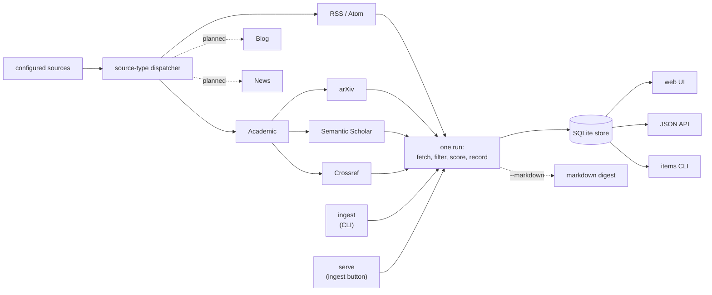
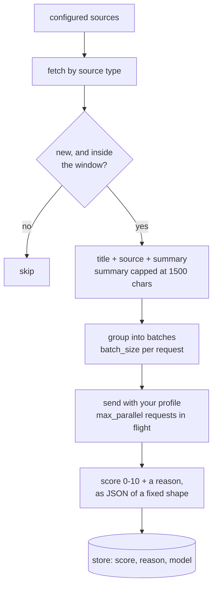

# Architecture

## How it works



`ingest` and `serve` share the same cycle and store: `ingest` runs it once from the CLI and
can write the result as a markdown digest, while `serve` exposes the store over HTTP and can
trigger the same cycle in the background (see [docs/api.md](api.md)). State (seen items,
scores, digest history, user status/notes) lives in a local SQLite file, so re-runs only
score genuinely new items.

Everything `serve` exposes, the JSON API included, sits behind one login (see
[auth.md](auth.md)). The credentials live in the store's `auth` table; sessions live only in
the server's memory, and a browser that opts to stay signed in carries its own through a
restart in a cookie the server signs. The `auth` command changes the login from the CLI, writing the store
directly the way `items` does.

## Scoring flow



**What gets sent.** Three things per item: the source name, the title, and the normalized
summary supplied by the source. The scorer does not fetch the linked full text, so a score is
a judgement on the metadata or summary available from RSS/Atom or the academic provider.
The summary is capped at 1,500 characters before scoring.

**How it's grouped.** Articles are gathered into batches of `batch_size` and each batch is one
request, with `max_parallel` requests in flight. Both default to 1: a small local model reads
one article better than five, and Ollama queues concurrent requests anyway. Raise them against
a bigger model or an endpoint that genuinely serves in parallel, such as vLLM. Your profile
goes with every request, since the question is always "worth reading for this reader".

**What comes back.** A score from 0 to 10 and a sentence or two of reasoning per article, as
JSON in a fixed shape that the inference server enforces while the model writes rather than
asking it to comply. Score, reason and the model's name are saved against the article; one
that fails to score stays unscored and is retried next run, so a bad reply costs a run rather
than the article.

Each step has a knob, all of them in [configuration.md](configuration.md):

| Step | Knobs |
|---|---|
| What's eligible | `ingest.since`, a feed's own `since` and `max_items` |
| How much text | the 1,500-character cap (fixed), `model_tuning.num_ctx` for how much the model actually reads |
| How it's split | `inference.batch_size`, `inference.max_parallel` |
| How much reply | `model_tuning.tokens_per_item`, `tokens_overhead`, `reason_max_chars`, and `tokens_thinking` when `think` is on |

The limit of all this is the source material: an RSS feed that publishes a two-line teaser is
scored on that teaser, and academic sources are scored on the metadata or summary returned by
their provider. Full-text page retrieval is not part of the scoring path. Direct ingestion of
ordinary pages without a feed remains on the roadmap below.

## Layout

```
cmd/                  cobra CLI (root, ingest, serve, auth, items, eval)
internal/config       YAML config, feed list and profile loading
internal/ingest       source dispatch -> fetch -> filter -> score -> record cycle, plus the background run manager
internal/feeds        RSS/Atom normalization plus academic providers (arXiv, Crossref, Semantic Scholar)
internal/rank         Scorer interface, prompt/JSON parsing, batching, selection, heuristic
internal/inference    provider factory (ollama | vllm | heuristic)
internal/ollama       Ollama JSON-mode client
internal/vllm         OpenAI-compatible JSON-mode client
internal/httpclient   shared HTTP transport (bearer auth injection)
internal/retry        exponential backoff for a still-starting-up inference server
internal/digest       markdown renderer
internal/store        SQLite (seen dedup, digest history, user status/notes)
internal/server       composition root for serve: mounts api + web behind the login gate, health endpoints
internal/api          JSON API route set (/api/*)
internal/web          server-rendered htmx UI, the login gate and sessions, templates and static assets
internal/httplog      HTTP access-log middleware
internal/logger       zerolog setup for --debug/--trace
```

## Roadmap

- **Adaptive ranking** — feed `status`/`user_score`/`user_note` history (recorded via
  `items` or the API) back into the scoring prompt as liked/disliked examples.
- **Full-text crawl** — fetch the article page and score the piece itself, rather than the
  summary a feed chose to publish about it.
- **Scheduling & delivery** — systemd timer or cron to run ingest unattended, plus email,
  push or an output feed so the digest reaches you instead of waiting to be opened.
- **Postgres** — one store reachable from more than one of your machines, instead of each
  process owning a local file. Still one profile and one reader (see [store.md](store.md)).
